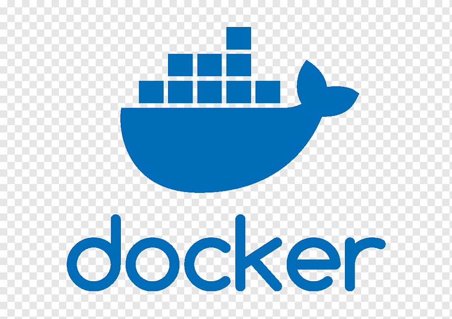

<h1><b>Hi there 👋 welcome to lilJuan4168 repository</b> </h1>

<h1><b>About me</b></h1>

My name is Juan Manuel Araoz, I am a <b>data-oriented programmer</b> with a preference for data engineering and data science.  I've been in the technologic industry for a while, i started my studies with electronics and now i'm immersing myself into the world of the data.

<h1><b>What do i do?</b></h1>

I was trained to give <b>solutions focused on data</b>, such as extraction, management, storage, visualization and predictions using machine learning models.

<h1><b>Technologic Stack</b></h1>

<table>
<tr>
    <th><h2> 👉 Data Engineering</h2></th>
    <th><h2>👉 Data Analytics &nbsp &nbsp &nbsp</h2></th>
    <th><h2>👉 Data Science &nbsp &nbsp &nbsp &nbsp</h2></th>
</tr>

<tr>
    <td>
 &nbsp Python
</td>
    <td>
 &nbsp Seaborn
</td>
    <td>
 &nbsp Scikit-learn
</td>
  </tr>

<tr>
    <td>
 &nbsp Numpy
</td>
    <td>
 &nbsp Matplotlib
</td>
    <td>
 &nbsp TensorFlow
</td>
  </tr>

<tr>
    <td>
 &nbsp Pandas
</td>
    <td>
 &nbsp PowerBI
</td>
    <td>
 &nbsp JupyterNotebook
</td>
  </tr>

</table>

<table>
<tr>
    <th><h2>👉 Databases &nbsp &nbsp &nbsp &nbsp &nbsp</h2></th>
    <th><h2>👉 Others &nbsp &nbsp &nbsp &nbsp &nbsp &nbsp &nbsp &nbsp &nbsp</h2></th>
    <th><h2>👉 Cloud Services &nbsp &nbsp &nbsp</h2></th>
</tr>

<tr>
    <td>
 &nbsp MySQL
</td>
    <td>
 &nbsp Docker
</td>
    <td>
 &nbsp Amazon AWS
</td>
  </tr>

<tr>
    <td>
 &nbsp PostgreSQL
</td>
    <td>
 &nbsp Git-GitHub
</td>
    <td>
-------
</td>
  </tr>

<tr>
    <td>
 &nbsp MongoDB
</td>
    <td>
 &nbsp Apache-Airflow
</td>
    <td>
-------
</td>
  </tr>

</table>